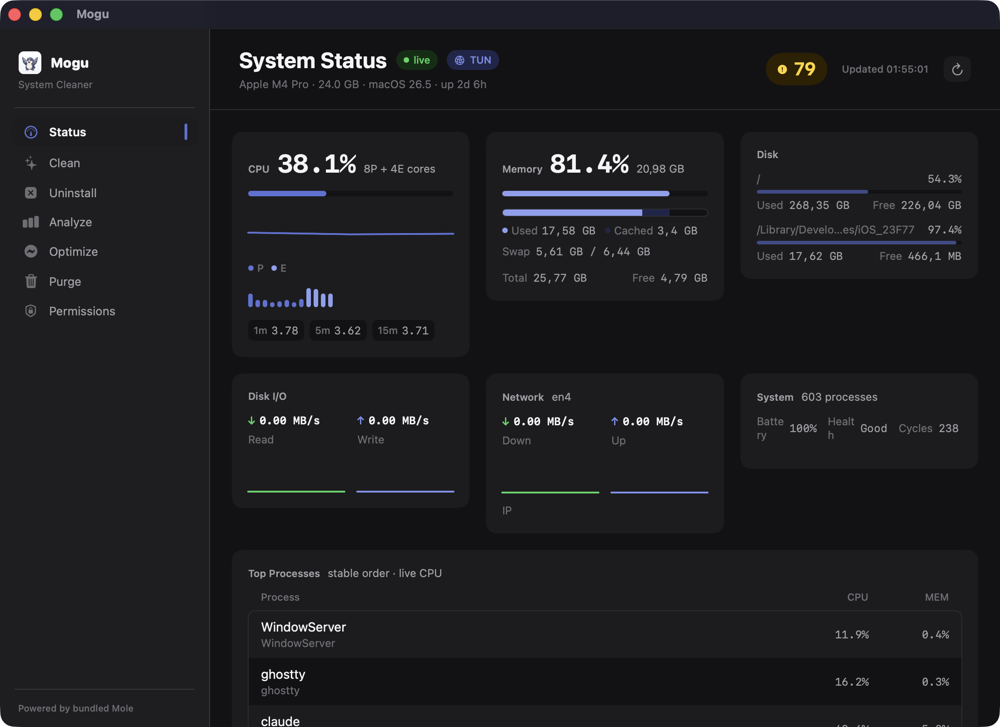
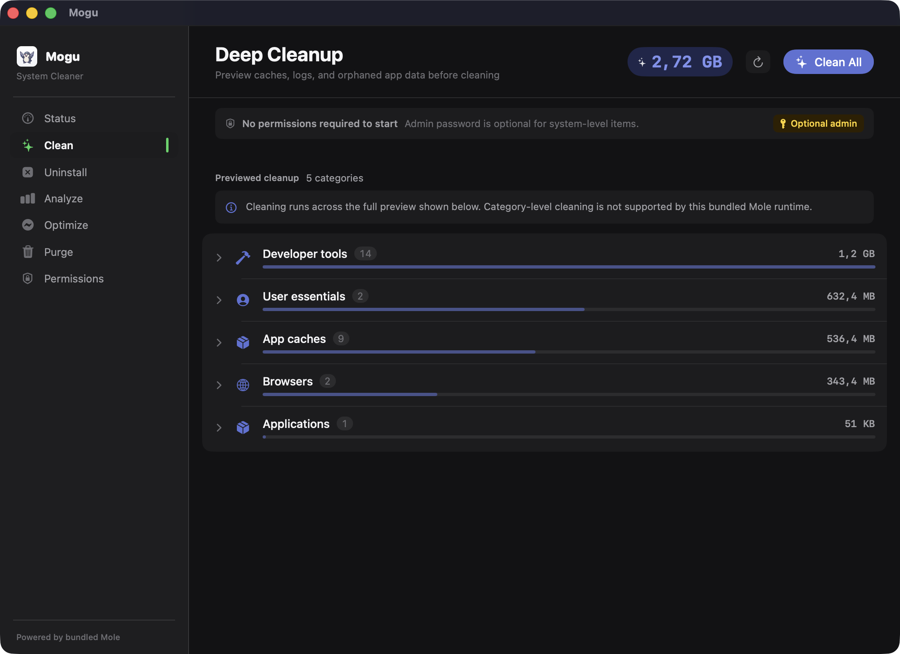
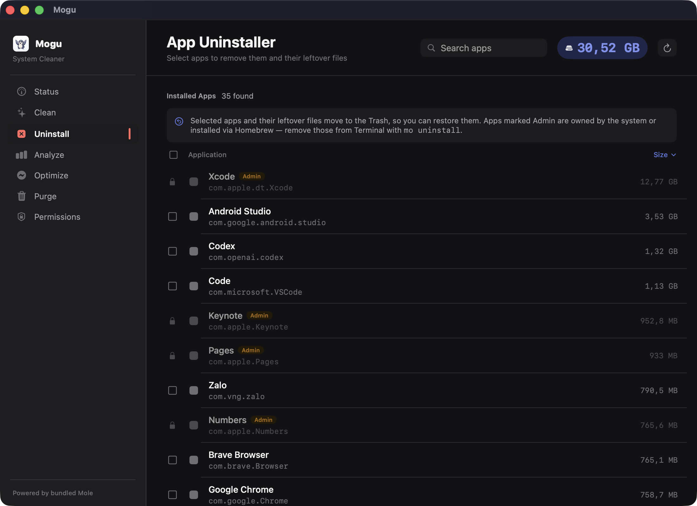
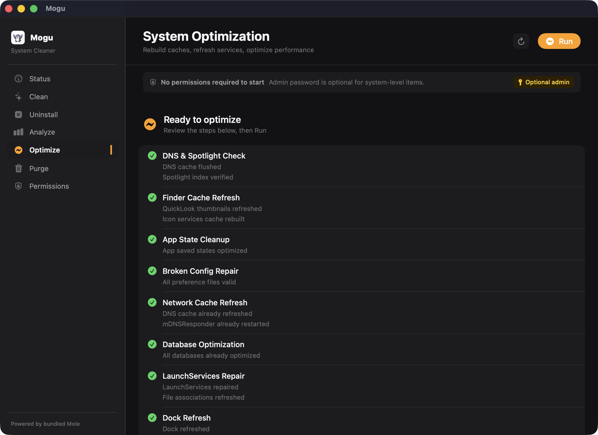
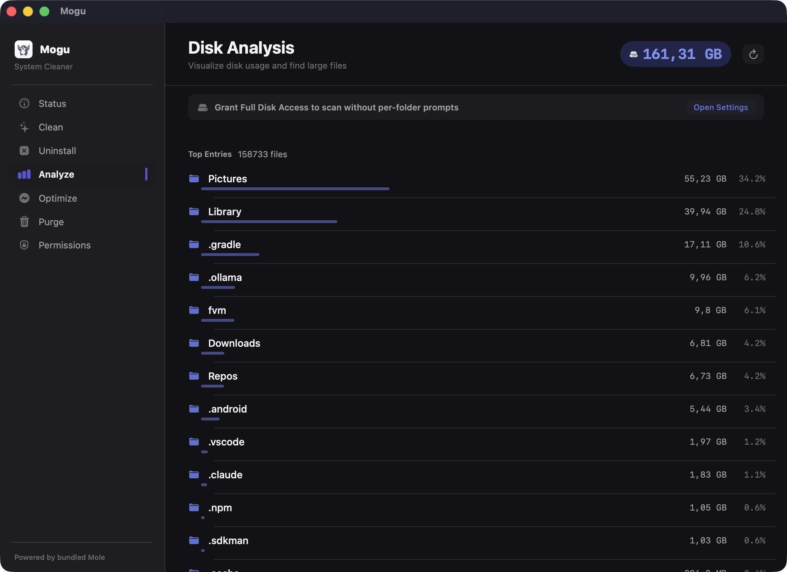
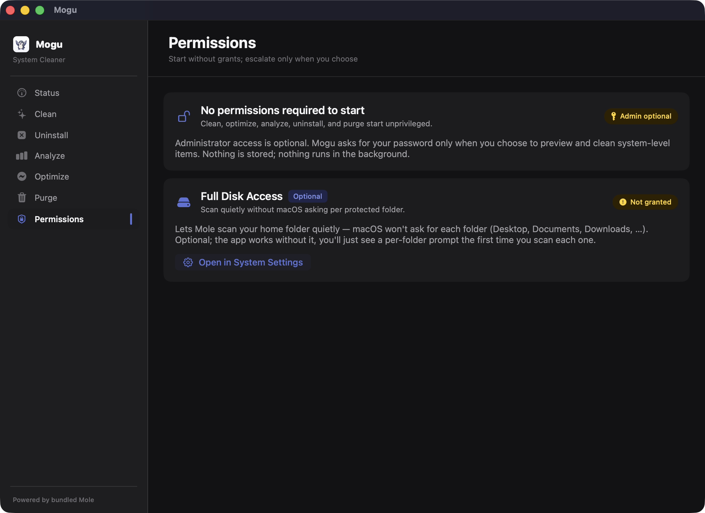

<div align="center">
  
  <h1>Mogu</h1>
  <p><em>A friendly mole that digs through your Mac to clean it — a native macOS GUI for Mole.</em></p>
  <p>
    
    
    
  </p>
</div>

> **Built on [Mole](https://github.com/tw93/Mole) by [@tw93](https://github.com/tw93).**
> Mogu is inspired by — and built directly on top of — Mole, the open-source Mac
> system cleaner. It bundles Mole's CLI runtime and wraps it in SwiftUI. All the
> cleaning power is Mole's; Mogu is just a friendly face for it. Mogu is an
> independent, unofficial GUI and is not affiliated with the Mole author.

## ❤️ Support Mole

Mogu wouldn't exist without Mole — please support the original project:

- 💎 **Want a polished, fully-supported native app?** Buy [**Mole for Mac**](https://mole.fit) — the official paid app by Mole's author, with visual cleanup review, app updates, uninstall, maintenance, disk maps, live status, and a menu-bar HUD. One license covers 2 Macs with lifetime updates.
- ⭐ **Star** [Mole on GitHub](https://github.com/tw93/Mole) and share it with friends.
- 🥩 **Sponsor** the author [here](https://cats.tw93.fun?name=Mole).

The Mole CLI itself is free and open source — Mogu builds on that.

## Requirements

- macOS 14.0 (Sonoma) or later
- Swift 6.3+ and Go 1.21+ (only to build from source; the runtime is bundled)
- No separate Mole CLI install required — Mogu bundles a pinned Mole runtime.

## Features

| Panel | Description |
|---|---|
| **Status** | Live system monitoring — CPU, memory, disk, battery, network, top processes |
| **Clean** | Preview and execute deep cleanup of caches, logs, browser leftovers |
| **Uninstall** | Select apps to remove them and their leftover files; preview each one, then move it to the Trash. Sort by name or size. |
| **Optimize** | One-click system optimization — rebuild caches, refresh services |
| **Analyze** | Visual disk usage breakdown with large-file detection |
| **Purge** | Find and clean project build artifacts (`node_modules`, `target`, etc.) |
| **Permissions** | Explains the minimal permission model; surfaces optional Full Disk Access |

## Screenshots

<div align="center">
  
  <br /><em>Status: live CPU, memory, disk, network, and top processes</em>
  <br /><br />
  
  <br /><em>Clean: preview caches, logs, and orphaned app data by category, then clean</em>
  <br /><br />
  
  <br /><em>Uninstall: select apps to remove them and their leftovers; system and Homebrew apps are flagged</em>
  <br /><br />
  
  <br /><em>Optimize: review maintenance tasks (caches, DNS, Spotlight, LaunchServices), then run</em>
  <br /><br />
  
  <br /><em>Analyze: visualize disk usage and find the largest files and folders</em>
  <br /><br />
  
  <br /><em>Permissions: start with no grants; Administrator and Full Disk Access stay optional</em>
</div>

<sub>Purge (project build-artifact cleanup) is not shown because the capture machine had no <code>node_modules</code>/<code>target</code>/<code>.build</code> artifacts in its scanned paths.</sub>

## Permissions

Mogu needs **no permission to start** — no prompt on launch or tab switch. When you
choose to run a **Clean** or **Optimize**, it requests your administrator password
**up front** (admin-first). Granting it cleans user-owned items in your own context,
then system-level items with elevation; cancelling falls back to the unprivileged
run. Full Disk Access is **optional** — it only quiets the per-folder prompts during
home-directory scans. Nothing is stored and nothing runs in the background.

## Safety

All destructive operations (clean, optimize, purge, uninstall) **preview first** with
`--dry-run` before anything is deleted: the app never runs a destructive command without
showing what will be affected. Preview-before-delete is enforced at both the unprivileged and
elevated tiers. Uninstalls move apps and their leftovers to the **Trash**, so a removal is
recoverable; apps owned by the system or installed via Homebrew are flagged and left to the
Mole CLI.

Mogu builds Mole from the `Vendor/Mole` git submodule and bundles it into
`Mogu.app/Contents/Resources/MoleRuntime`, so Homebrew Mole updates do not change app
behavior.

## Building

```bash
# First clone only: pull the bundled Mole runtime
git submodule update --init --recursive

# Compile the Swift executable
make build

# Build + sign the app bundle with the pinned Mole runtime (needs Go 1.21+)
make app

open Mogu.app
```

`make parser-test` runs the regression suite that guards the fragile text parsers
against golden fixtures.

## Architecture

```
Sources/
  MoguApp.swift               # App entry point
  ContentView.swift           # Sidebar navigation + action wiring
  Models/
    SystemStatus.swift        # Data models for mo command output
    StatusHistory.swift       # Rolling history for the Status charts
    ProcessStep.swift         # Optimize stream parser (StepStreamParser)
    Permission.swift          # Permission kinds + copy
  Services/
    MoService.swift           # Async actor wrapping the bundled `mo` CLI
    MoOutputParser.swift      # Unit-testable text parsers for no-JSON commands
    PermissionsService.swift  # Probes admin / Full Disk Access state
  Theme/
    DesignTokens.swift        # Typography, navy/indigo accent, spacing, radii
  Views/
    StatusView.swift          # System health dashboard
    CleanView.swift           # Deep cleanup with category selection
    UninstallView.swift       # Multi-select uninstaller, preview sheet, sortable list
    OptimizeView.swift        # System optimization runner
    AnalyzeView.swift         # Disk usage visualization
    PurgeView.swift           # Project artifact cleanup
    PermissionsView.swift     # Permission model explainer
    Components/
      ErrorStateView.swift    # Shared error + retry state
      StatusCharts.swift      # Charts for the Status dashboard
```

The app icon and sidebar brand mark are generated from `icon-source.png` by
`scripts/make_icon.sh`.

## Credits

- [**Mole**](https://github.com/tw93/Mole) by [@tw93](https://github.com/tw93) — the engine Mogu is built on (MIT).
- Mogu — the SwiftUI GUI shell (MIT).

## License

MIT
